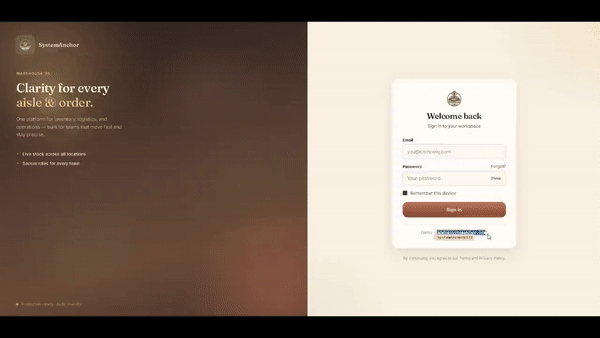
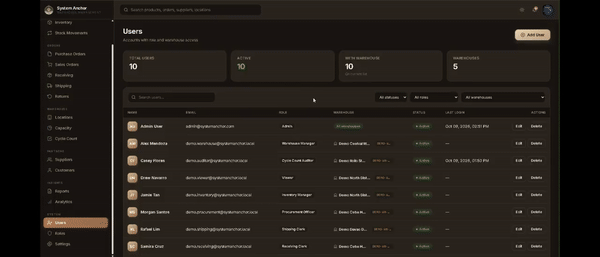
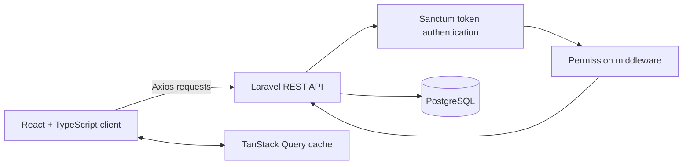

# SystemAnchor

SystemAnchor is a full-stack warehouse management system for recording products, stock activity, purchasing, receiving, sales fulfillment, and warehouse access. The React and TypeScript client communicates with a Laravel REST API backed by PostgreSQL.

## Project Overview

The application manages products, categories, suppliers, customers, warehouses, purchase orders, goods receipts, sales orders, shipments, returns, stock movements, users, roles, and permissions. The frontend owns the user experience and server-state handling; the backend owns validation, authentication, authorization, and persisted operational data.

## Demo Videos

Click a GIF preview to open the compact recording, or use YouTube for the full walkthrough.

### Application walkthrough

This walkthrough covers the main warehouse workflow, including the dashboard,
inventory, suppliers, purchase orders, receiving, sales orders, and fulfillment.

[](https://github.com/moniquebustillos16/systemanchor/blob/main/docs/videos/main-demo-small.mp4)

[Watch on YouTube](https://youtu.be/x8MKAmA1D7g)

### Role-based access walkthrough

This walkthrough shows how an administrator manages users and roles, chooses
what each user can view or edit, and limits users to specific warehouse data.

[](https://github.com/moniquebustillos16/systemanchor/blob/main/docs/videos/role-access-small.mp4)

[Watch on YouTube](https://youtu.be/TG1yWSiqX5g)

## Key Features

- Product, category, supplier, customer, and warehouse management
- Inventory listings, stock movements, and cycle counts
- Purchase orders, goods receipts, sales orders, shipments, and returns
- Warehouse zones, bins, capacity, and user warehouse assignments
- Role and permission management, dashboard data, notifications, reports, and profiles

## Technology Stack

| Layer | Technology |
| --- | --- |
| Frontend | React 19, TypeScript, Vite, React Router |
| Client data | TanStack Query, Axios |
| Backend | PHP 8.3+, Laravel 13, Laravel Sanctum, REST API |
| Database | PostgreSQL with `pgcrypto` |
| Visualization | Recharts |
| Checks | ESLint, TypeScript build, PHPUnit/Laravel test runner |

## System Architecture



### Frontend responsibilities

- Provides routed pages and role-aware navigation and controls.
- Uses Axios with `VITE_API_URL`, or `http://127.0.0.1:8000/api` by default.
- Sends the stored Sanctum bearer token and clears local authentication state after a `401` response.
- Uses TanStack Query for cached server data, query keys, and mutation invalidation.

### Backend responsibilities

- Exposes REST endpoints in `backend/routes/api.php`.
- Validates input in controllers and form requests.
- Issues and revokes Sanctum personal-access tokens.
- Applies permission checks and stores operational data in PostgreSQL.

## Authentication and Authorization

`POST /api/login` validates credentials and creates a Sanctum personal-access token. The client sends that token as a bearer token on later requests; `POST /api/logout` deletes the current token.

Most operational routes are within `auth:sanctum` and declare a permission such as `inventory.view` or `purchase_orders.create`. `PermissionMiddleware` allows the `Admin` role through and otherwise checks role permissions. The client adjusts its navigation and controls, but the API is the authorization boundary.

Users can have warehouse assignments and an `access_all_warehouses` flag. Warehouse-specific scope is implemented in relevant controllers, including purchase orders. Scope and authorization need review endpoint by endpoint as the system evolves.

## Database Overview

Laravel migrations define users, roles, permissions, warehouses, zones, bins, products, inventories, stock movements, suppliers, customers, purchase orders, goods receipts, sales orders, shipments, returns, notifications, and user-warehouse assignments.

PostgreSQL is the supported application database. PHPUnit is configured for in-memory SQLite, which is separate from the local application configuration and should be validated against the migration chain before relying on wider test coverage.

## Business Workflows

### Inventory, movements, and transfers

Products carry current quantity and warehouse information. The stock-movement endpoint supports `IN`, `OUT`, `TRANSFER`, and `ADJUSTMENT`. Its create operation uses a database transaction and rejects outgoing or transfer quantities above the current product quantity. A transfer records source and destination warehouse IDs; the current implementation updates the product warehouse reference when a destination is supplied. Review this behavior before production use where independent per-warehouse balances are required.

### Purchasing and receiving

Purchase orders are associated with suppliers and can be associated with warehouses. The purchase-order controller applies warehouse access checks for users without all-warehouse access. Goods receipts record expected and received quantities against a purchase order, supplier, warehouse, and optional receiver. Completing a receipt updates its status and can create a quantity-mismatch notification.

### Sales, fulfillment, and permissions

The API includes sales-order, shipment, and return list, detail, create, update, and delete endpoints. Shipment delivery and return completion actions are also defined. Administrators can manage users, roles, permissions, role-permission assignments, and user warehouse assignments. Non-administrator access is based on role permissions and protected routes enforce the required permission.

## Installation and Setup

### Prerequisites

- PHP 8.3+ with PostgreSQL PDO support
- Composer
- Node.js 20+ and npm
- PostgreSQL with the `pgcrypto` extension available

### Backend

In one terminal:

```powershell
cd backend
composer install
Copy-Item .env.example .env
php artisan key:generate
```

Configure the database values in `backend/.env`, then create the schema and sample data:

```powershell
php artisan migrate --seed
php artisan serve
```

The API is served at `http://127.0.0.1:8000/api` by default.

### Frontend

In a second terminal from the repository root:

```powershell
cd frontend
npm install
npm run dev
```

Vite serves the client at `http://localhost:5173` by default.

## Environment Configuration

Start from `backend/.env.example`. At minimum, configure the application key and PostgreSQL connection:

```env
APP_KEY=
DB_CONNECTION=pgsql
DB_HOST=127.0.0.1
DB_PORT=5432
DB_DATABASE=systemanchor
DB_USERNAME=postgres
DB_PASSWORD=
```

For a non-default API address, create `frontend/.env.local`:

```env
VITE_API_URL=http://127.0.0.1:8000/api
```

Never commit populated `.env` files, API tokens, or database passwords. The database seeder creates sample users and data for local development; inspect and change or remove seeded credentials before using any non-local environment.

## Running the Application

Keep the API and frontend servers running in separate terminals. After `php artisan migrate --seed`, sign in using a local seeded account listed in `backend/database/seeders/DatabaseSeeder.php`. Change seeded credentials before sharing an environment.

## Testing

Available project commands:

```powershell
# Frontend
cd frontend
npm run lint
npm run build

# Backend
cd ../backend
composer test
```

`composer test` clears Laravel configuration and runs `php artisan test`. The repository currently contains only the default example unit and feature tests; these commands have not been represented as passing in this README. Add feature coverage for authentication, permissions, warehouse scoping, migrations, and order workflows.

## Deployment

The repository contains a GitHub Pages workflow for the static documentation/demo page in `.github/workflows/deploy-pages.yml`. It does not contain AWS infrastructure, application deployment scripts, container definitions, or CI/CD configuration for the Laravel API and React application.

For an AWS deployment, define the hosting architecture outside this repository. At minimum, provide production environment variables, a PostgreSQL instance, HTTPS, a Laravel migration process, persistent writable Laravel storage, and a method to serve the built frontend and API. Do not use local seed data or credentials in production.

## Known Limitations and Future Improvements

- Automated coverage is minimal and does not validate critical business workflows.
- Authorization and warehouse scope should be audited consistently across all endpoints.
- Warehouse-transfer behavior needs stronger per-warehouse inventory modeling and production-grade data-integrity coverage.
- Some migrations perform destructive or non-reversible transformations. Two identifier/status alignment migrations explicitly reject rollback; rehearse migrations and backup/restore procedures against a production-like database.
- No API/application AWS deployment configuration is versioned in this repository.

## Repository Layout

- `backend/` — Laravel API, migrations, seeders, and tests
- `frontend/` — React client, API modules, hooks, and route-level pages
- `docs/` — static demo-page assets
- `.github/workflows/` — GitHub Pages deployment workflow

## License

Portfolio and demonstration use.
